This document is a source of truth for both client and tenant side apps. System design and infrastructure should be built based on this document.

## Functional Requirements

### Client side (customer-facing booking site)

- **User** can see information about **Tenant**
- **User** can choose one or more services
- **User** can see open appointment time slots, filtered by chosen service(s) and duration
- **User** can choose a specific **Professional** to book with, or "any available"
- **User** can view, reschedule, or cancel an existing appointment via a magic link (see below) — no account/login required
- **Tenant** can edit colors and logo for the client side page (via `config_json`)

### Tenant side (CMS)

- **Tenant** can edit service list and service details (name, price, duration, assigned professionals)
- **Tenant** can edit list of professionals
- **Tenant** can edit business hours
- **Tenant** can block off time (vacation, breaks, holidays) per professional or business-wide
- **Tenant** can book, reschedule, or cancel appointments on a customer's behalf
- **Tenant** can monitor booked appointments (calendar/list view)
- **Professional** can log into the CMS with a restricted role: view/reschedule/cancel their own appointments and manage their own availability (hours, time-off) — cannot edit services, pricing, other professionals, or branding

## Booking Access — Magic Link

Resolves the open question "should User log in to book an appointment?" — decision: **no login system**. Instead, each appointment gets a single-use-context access token.

**Flow**

1. Customer books an appointment (name + phone number, no account creation).
2. Server generates a random, high-entropy token, stores its hash on the `Appointment` row, and sets an expiry (appointment end time + 24h grace period).
3. Server sends an email to `email` with a link: `https://{tenant-domain}/manage/{token}`.
4. Visiting that link authorizes read/reschedule/cancel actions against that one appointment only — it does not authenticate a customer identity or grant access to other bookings.
5. Rescheduling issues a new token (old one invalidated) so a leaked/expired link can't be reused after the appointment moves.

**Recovering a lost link**: customer enters their phone number on a "resend link" page; server looks up upcoming, non-cancelled appointments for that phone number and re-sends valid tokens. Rate-limit this endpoint (phone-number enumeration risk).

## CMS Access & Roles

The CMS is single shared deployment, tenant-scoped via JWT (per project architecture). Within a tenant, two roles:

- **owner**: full access — services, pricing, professionals, hours, branding/config, all appointments, staff logins. Exactly one `owner` per tenant.
- **professional**: restricted — own appointments (view/reschedule/cancel), own hours and time-off only. No access to pricing, other professionals' data, or branding. A tenant can have any number of `professional` logins.

Deactivating a `Professional` (business record) does not automatically disable their `TenantUser` login — the owner deactivates the login by hand as a separate step. No cascade automation between the two.

Login identity is separated from the business-facing `Professional` record (a `Professional` can exist without ever logging in — e.g. a stylist whose schedule the owner manages directly). `TenantUser` holds credentials + role and optionally links to a `Professional` row when role is `professional`.

JWT claims: `sub` (user id), `tenant_id`, `role`, `professional_id` (present only for `professional` role) — the CMS enforces role-based feature access at the API layer, separate from and in addition to Postgres RLS (RLS scopes rows to a tenant; it doesn't know about roles within a tenant, so professional-vs-owner restrictions must be enforced in application logic).

## Non-Functional Requirements

- SEO optimization on the public booking site
- Public site P95 load time target: 300ms under normal traffic (flag: aggressive once per-request tenant/domain resolution is in the path — validate early against the Redis-cached lookup, don't assume it holds under cold cache or custom-domain verification lookups)
- Mobile-first on the client side; easy-to-navigate UI on both apps
- Every table carries `tenant_id` with Row-Level Security — no exceptions, including junction and lookup tables added below

## Out of Scope (for now)

- In-app booking payment collection (see note below)
- Customer accounts / login
- Client-side template/layout customization by tenant (colors/logo only, via `config_json`)
- Magic-link SMS delivery (email only, until SMS capture exists)

**Note on payment (confirmed)**: the website is reservation-only. The customer pays in person at the salon after the appointment; no online checkout happens during booking, and `Appointment` carries no payment-status or payment-session fields. Online payment (gateway integration, adapters, etc.) is out of scope for now — not designed here, revisit if/when that work is scheduled.

## Assumptions Made Resolving Prior Conflicts

- **Service ↔ Professional is many-to-many** (a professional can perform several services; a service can be performed by several professionals), via a join table. The two original docs disagreed on this (array-style fields vs. singular FK) — confirm this matches reality before building the schema, since it's the one modeling decision with the biggest schema impact.
- **Time-slots are computed, not stored.** Rather than a granular `Time-slot` row per bookable interval, availability is derived at query time from `BusinessHours` minus existing `Appointment`s minus `TimeOff` blocks. This is what "Tenant can change status of time slots" is modeled as below (create/remove a `TimeOff` block) rather than a giant pre-generated slot table.

## Data Model

All tables include `tenant_id uuid` + RLS policy scoping to the current tenant, even where not repeated below.

### Tenant
| column | type | notes |
|---|---|---|
| `id` | uuid, PK | |
| `name` | text | |
| `timezone` | text | IANA tz, needed for hours/slot math |
| `subdomain` | text, unique | e.g. `acme` for `acme.platform.ge` |
| `custom_domain` | text, unique, nullable | CNAME target |
| `domain_verified_at` | timestamptz, nullable | null until DNS TXT verification passes |
| `config_json` | jsonb | theme/presentation config (colors, logo, copy) |
| `created_at` | timestamptz | |

### Professional
| column | type | notes |
|---|---|---|
| `id` | uuid, PK | |
| `tenant_id` | uuid, FK | |
| `name` | text | |
| `created_at` | timestamptz | |

### TenantUser
| column | type | notes |
|---|---|---|
| `id` | uuid, PK | |
| `tenant_id` | uuid, FK | |
| `professional_id` | uuid, FK, nullable | set only when `role = professional`; null for `owner` |
| `email` | text, unique per tenant | login identifier |
| `password_hash` | text | email+password login |
| `role` | text | `owner` \| `professional` — exactly one `owner` row per `tenant_id` (partial unique constraint) |
| `is_active` | boolean, default true | manually toggled by the owner; not auto-linked to `Professional` deactivation |
| `created_at` | timestamptz | |
| `last_login_at` | timestamptz, nullable | |

### Service
| column | type | notes |
|---|---|---|
| `id` | uuid, PK | |
| `tenant_id` | uuid, FK | |
| `name` | text | |
| `duration_minutes` | int | |
| `price` | numeric | current price; appointments snapshot this at booking time |
| `created_at` | timestamptz | |

### ServiceProfessional (join table)
| column | type | notes |
|---|---|---|
| `service_id` | uuid, FK | |
| `professional_id` | uuid, FK | |
| `tenant_id` | uuid, FK | denormalized for RLS simplicity |

Composite PK on (`service_id`, `professional_id`).

### BusinessHours
| column            | type               | notes                      |
| ----------------- | ------------------ | -------------------------- |
| `id`              | uuid, PK           |                            |
| `tenant_id`       | uuid, FK           |                            |
| `professional_id` | uuid, FK, nullable | null = applies tenant-wide |
| `day_of_week`     | smallint           | 0–6                        |
| `start_time`      | time               |                            |
| `end_time`        | time               |                            |

### TimeOff
| column | type | notes |
|---|---|---|
| `id` | uuid, PK | |
| `tenant_id` | uuid, FK | |
| `professional_id` | uuid, FK, nullable | null = whole business closed |
| `start_at` | timestamptz | |
| `end_at` | timestamptz | |
| `reason` | text, nullable | e.g. "vacation", "holiday" |

### Appointment
| column                    | type                   | notes                                                                                   |
| ------------------------- | ---------------------- | --------------------------------------------------------------------------------------- |
| `id`                      | uuid, PK               |                                                                                         |
| `tenant_id`               | uuid, FK               |                                                                                         |
| `service_id`              | uuid, FK               |                                                                                         |
| `professional_id`         | uuid, FK, nullable     | null = "any available" was chosen                                                       |
| `user_name`               | text                   |                                                                                         |
| `phone_number`            | text                   |                                                                                         |
| `email`                   | text                   |                                                                                         |
| `start_at`                | timestamptz            |                                                                                         |
| `end_at`                  | timestamptz            | derived from `start_at` + service duration at booking time, stored for query simplicity |
| `price`                   | numeric                | snapshot of `Service.price` at booking time                                             |
| `status`                  | text                   | `booked` \| `cancelled` \| `completed` \| `no_show`                                     |
| `access_token_hash`       | text, unique, nullable | null after expiry/cancellation cleanup if desired                                       |
| `access_token_expires_at` | timestamptz            |                                                                                         |
| `created_at`              | timestamptz            |                                                                                         |
| `updated_at`              | timestamptz            |                                                                                         |

## ER Diagram

```mermaid
erDiagram
    TENANT ||--o{ PROFESSIONAL : has
    TENANT ||--o{ TENANT_USER : has
    TENANT ||--o{ SERVICE : has
    TENANT ||--o{ BUSINESS_HOURS : has
    TENANT ||--o{ TIME_OFF : has
    TENANT ||--o{ APPOINTMENT : has

    PROFESSIONAL ||--o| TENANT_USER : "logs in as (optional)"
    PROFESSIONAL ||--o{ SERVICE_PROFESSIONAL : performs
    PROFESSIONAL ||--o{ BUSINESS_HOURS : "scoped to (optional)"
    PROFESSIONAL ||--o{ TIME_OFF : "scoped to (optional)"
    PROFESSIONAL ||--o{ APPOINTMENT : "booked with (optional)"

    SERVICE ||--o{ SERVICE_PROFESSIONAL : "offered by"
    SERVICE ||--o{ APPOINTMENT : "booked for"

    TENANT {
        uuid id PK
        text name
        text timezone
        text subdomain
        text custom_domain
        timestamptz domain_verified_at
        jsonb config_json
        timestamptz created_at
    }

    PROFESSIONAL {
        uuid id PK
        uuid tenant_id FK
        text name
        timestamptz created_at
    }

    TENANT_USER {
        uuid id PK
        uuid tenant_id FK
        uuid professional_id FK
        text email
        text password_hash
        text role
        boolean is_active
        timestamptz created_at
        timestamptz last_login_at
    }

    SERVICE {
        uuid id PK
        uuid tenant_id FK
        text name
        int duration_minutes
        numeric price
        timestamptz created_at
    }

    SERVICE_PROFESSIONAL {
        uuid service_id FK
        uuid professional_id FK
        uuid tenant_id FK
    }

    BUSINESS_HOURS {
        uuid id PK
        uuid tenant_id FK
        uuid professional_id FK
        smallint day_of_week
        time start_time
        time end_time
    }

    TIME_OFF {
        uuid id PK
        uuid tenant_id FK
        uuid professional_id FK
        timestamptz start_at
        timestamptz end_at
        text reason
    }

    APPOINTMENT {
        uuid id PK
        uuid tenant_id FK
        uuid service_id FK
        uuid professional_id FK
        text user_name
        text phone_number
        text email
        timestamptz start_at
        timestamptz end_at
        numeric price
        text status
        text access_token_hash
        timestamptz access_token_expires_at
        timestamptz created_at
        timestamptz updated_at
    }
```

Notes: `PROFESSIONAL ||--o| TENANT_USER` is optional in both directions — a `Professional` may have no login, and a `TENANT_USER` with role `owner` has no `professional_id`. Nullable `professional_id` on `BUSINESS_HOURS`, `TIME_OFF`, and `APPOINTMENT` means "applies tenant-wide" / "any available," per the notes in the tables above.

## Read/Write Pattern

- **Client-side app**: read-heavy, ~10:1. Reads: services, professionals, computed availability, tenant config. Writes: create appointment, reschedule/cancel via magic link.
- **Tenant-side app (CMS)**: read-heavy, ~5:1. Reads: services, professionals, hours, time-off, appointments, config. Writes: edit services/professionals/hours/config, create/edit/cancel appointments, create/remove time-off blocks.

## Capacity Estimates

Assumptions (order-of-magnitude, adjust once real pilot data exists): 5 professionals/tenant, 15 services/tenant, 25 booked appointments/tenant/day, 10:1 read:write ratio on the public site (established above), traffic concentrated in a ~12h operating window with peak load ~5x the daily average, ~15–20% of tenants adopt a custom domain, 3-year appointment retention for history/reporting.

| metric | 500 tenants | 10,000 tenants | 100,000 tenants |
|---|---|---|---|
| Professionals | 2,500 | 50,000 | 500,000 |
| Services | 7,500 | 150,000 | 1,500,000 |
| Appointments/day | 12,500 | 250,000 | 2,500,000 |
| Appointment rows after 3 years | ~14M | ~275M | ~2.75B |
| Public-site reads/day | ~125K | ~2.5M | ~25M |
| Avg req/s (12h window) | ~3 | ~58 | ~580 |
| Peak req/s (~5x avg) | ~15 | ~290 | ~2,900 |
| Custom domains (~15–20%) | ~75–100 | ~1,500–2,000 | ~15,000–20,000 |

**500 tenants** — everything from earlier answers holds as-is: one Postgres primary, one Redis instance, a couple of app-server replicas for uptime rather than load. 14M appointment rows over 3 years is trivial with a `(tenant_id, start_at)` index — no partitioning, no read replica, no connection pooler needed yet. Custom domains (under ~100) are cheap to onboard by hand via your host's dashboard, consistent with the "onboard pilot tenants manually" approach in your project scope.

**10,000 tenants** — this is where a few things stop being optional. Peak ~290 req/s means the public site needs to actually scale horizontally (multiple app instances behind a load balancer), and at that point Postgres' default connection limits get exceeded by pooled connections from every app replica — add PgBouncer (transaction-pooling mode) in front of Postgres. A read replica becomes worth it to keep CMS/reporting reads off the primary that's serving latency-sensitive public traffic. 275M appointment rows is still fine on one well-indexed table, but start planning partitioning (by month) before it becomes urgent. Custom domains in the 1,500–2,000 range outgrow manual dashboard onboarding — this is the point to build (or buy, via Cloudflare for SaaS / Vercel Domains API) automated verification + certificate issuance, since hand-verifying DNS TXT records one tenant at a time doesn't scale past a few hundred.

**100,000 tenants** — raw data volume, not the multi-tenancy model, becomes the constraint. ~2.75B appointment rows in a single unpartitioned table will fight you on vacuum, index bloat, and query planning — partition by month (and likely sub-partition by `tenant_id` hash) so RLS filtering and partition pruning work together instead of against each other. At ~2,900 req/s peak you need a real caching layer for availability computation (not just domain resolution) and a Redis deployment that's itself highly available — a Redis outage here takes tenant resolution down for 100K businesses at once, not one. Depending on write concentration, a single Postgres primary may still hold if well-tuned, but this is the scale at which sharding tenants across multiple Postgres clusters (routed by `tenant_id`) starts being a legitimate conversation rather than premature optimization. 15,000–20,000 custom domains needs the automated domain lifecycle from the 10K stage to also handle renewal monitoring and cleanup for churned tenants, not just initial issuance.

The shared-tables-plus-RLS decision itself doesn't need revisiting at any of these scales — what changes is the amount of *operational* scaffolding (pooling, replicas, partitioning, sharding) layered on top of it as row counts and QPS grow.

## Still Open

No open modeling questions remain at this pass. Revisit this section as new requirements surface.
