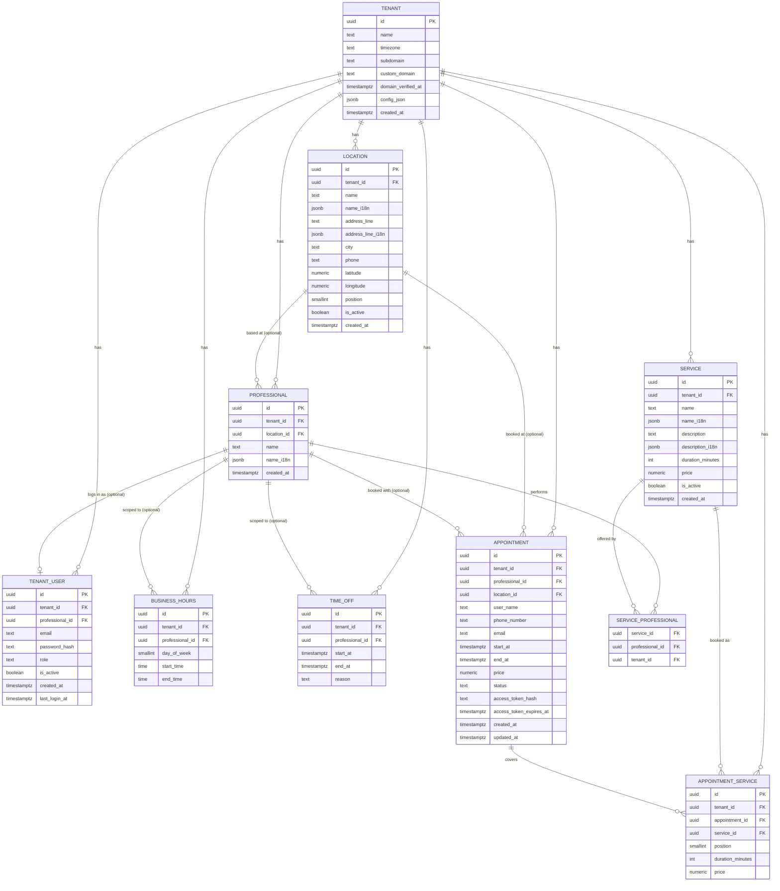

This document is a source of truth for both client and tenant side apps. System design and infrastructure should be built based on this document.

## Functional Requirements

### Client side (customer-facing booking site)

- **User** can see information about **Tenant**
- **User** can choose one or more services
- **User** can see open appointment time slots, filtered by chosen service(s) and duration
- **User** can choose a specific **Professional** to book with, or "any available"
- **User** can choose which **Location** to book at, when the tenant has more than one (R150)
- **User** can view, reschedule, or cancel an existing appointment via a magic link (see below) — no account/login required
- **User** can read the site in any of the tenant's enabled locales, chosen with a switcher (R160)
- **Tenant** can edit colors and logo for the client side page (via `config_json`)
- **Tenant** can set a public-site title and description, per enabled locale (R170)

**Scope of the public site.** It exists to take a booking. Its whole content inventory is: the
tenant's title/description and logo, the service list, the location list, the booking flow, and
the magic-link management pages. Gallery, about-us, team biographies, testimonials and blog are
deliberately *not* part of it — a tenant wanting those has a marketing site elsewhere and links
to this one. This is a product decision, not a deferral.

### Tenant side (CMS)

- **Tenant** can edit service list and service details (name, price, duration, assigned professionals)
- **Tenant** can edit list of professionals
- **Tenant** can edit business hours
- **Tenant** can block off time (vacation, breaks, holidays) per professional or business-wide
- **Tenant** can book, reschedule, or cancel appointments on a customer's behalf
- **Tenant** can monitor booked appointments (calendar/list view)
- **Tenant** can edit the list of locations (branches) and assign each professional to one (R150)
- **Tenant** can write the public-site title and description, and translate service and location names, per enabled locale (R160/R170)
- **Professional** can log into the CMS with a restricted role: view/reschedule/cancel their own appointments and manage their own availability (hours, time-off) — cannot edit services, pricing, other professionals, or branding

## Requirement Ids

Code that implements a requirement is tagged with an `// Rxx:` comment naming it, and the test
that pins that behaviour carries the same tag. The ids are stable; they are never renumbered.

`R10`–`R140` were assigned as the CMS and booking engine were built and currently exist **only**
as those code comments — they are not written down here yet, and back-filling them from
`grep -rn "R[0-9]*:" apps packages` is worth doing. The ids this feature introduces:

| id | requirement |
|---|---|
| R150 | A customer picks which location to book at when the tenant has more than one; the choice filters the professionals offered and is recorded on the appointment. |
| R160 | The public site renders in any of the tenant's enabled locales. The visitor chooses with a switcher; the choice is remembered in a cookie and the URL does not change. |
| R170 | A tenant authors a public-site title and description, per enabled locale. |
| R180 | A professional with no location works at every location. |
| R190 | A location with appointment history is deactivated, never deleted. |

## Booking Access — Magic Link

Resolves the open question "should User log in to book an appointment?" — decision: **no login system**. Instead, each appointment gets a single-use-context access token.

**Flow**

1. Customer books an appointment (name + phone number, no account creation).
2. Server generates a random, high-entropy token, stores its hash on the `Appointment` row, and sets an expiry (appointment end time + 24h grace period).
3. Server sends an email to `email` with a link: `https://{tenant-domain}/manage/{token}`.
4. Visiting that link authorizes read/reschedule/cancel actions against that one appointment only — it does not authenticate a customer identity or grant access to other bookings.
5. Rescheduling issues a new token (old one invalidated) so a leaked/expired link can't be reused after the appointment moves.

**Recovering a lost link**: customer enters their phone number on a "resend link" page; server looks up upcoming, non-cancelled appointments for that phone number and re-sends valid tokens. Rate-limit this endpoint (phone-number enumeration risk).

## CMS Access & Roles

The CMS is single shared deployment, tenant-scoped via JWT (per project architecture). Within a tenant, two roles:

- **owner**: full access — services, pricing, professionals, hours, branding/config, all appointments, staff logins. Exactly one `owner` per tenant.
- **professional**: restricted — own appointments (view/reschedule/cancel), own hours and time-off only. No access to pricing, other professionals' data, or branding. A tenant can have any number of `professional` logins.

Deactivating a `Professional` (business record) does not automatically disable their `TenantUser` login — the owner deactivates the login by hand as a separate step. No cascade automation between the two.

Login identity is separated from the business-facing `Professional` record (a `Professional` can exist without ever logging in — e.g. a stylist whose schedule the owner manages directly). `TenantUser` holds credentials + role and optionally links to a `Professional` row when role is `professional`.

JWT claims: `sub` (user id), `tenant_id`, `role`, `professional_id` (present only for `professional` role) — the CMS enforces role-based feature access at the API layer, separate from and in addition to Postgres RLS (RLS scopes rows to a tenant; it doesn't know about roles within a tenant, so professional-vs-owner restrictions must be enforced in application logic).

## Non-Functional Requirements

- SEO optimization on the public booking site
- Public site P95 load time target: 300ms under normal traffic (flag: aggressive once per-request tenant/domain resolution is in the path — validate early against the Redis-cached lookup, don't assume it holds under cold cache or custom-domain verification lookups)
- Mobile-first on the client side; easy-to-navigate UI on both apps
- Every table carries `tenant_id` with Row-Level Security — no exceptions, including junction and lookup tables added below

## Out of Scope (for now)

- In-app booking payment collection (see note below)
- Customer accounts / login
- Client-side template/layout customization by tenant. The tenant controls colors, logo, title and description (all via `config_json`) — the layout itself is fixed.
- Magic-link SMS delivery (email only, until SMS capture exists)

**Note on payment (confirmed)**: the website is reservation-only. The customer pays in person at the salon after the appointment; no online checkout happens during booking, and `Appointment` carries no payment-status or payment-session fields. Online payment (gateway integration, adapters, etc.) is out of scope for now — not designed here, revisit if/when that work is scheduled.

## Assumptions Made Resolving Prior Conflicts

- **Service ↔ Professional is many-to-many** (a professional can perform several services; a service can be performed by several professionals), via a join table. The two original docs disagreed on this (array-style fields vs. singular FK) — confirm this matches reality before building the schema, since it's the one modeling decision with the biggest schema impact.
- **Time-slots are computed, not stored.** Rather than a granular `Time-slot` row per bookable interval, availability is derived at query time from `BusinessHours` minus existing `Appointment`s minus `TimeOff` blocks. This is what "Tenant can change status of time slots" is modeled as below (create/remove a `TimeOff` block) rather than a giant pre-generated slot table.

## Data Model

All tables include `tenant_id uuid` + RLS policy scoping to the current tenant, even where not repeated below.

### Tenant
| column | type | notes |
|---|---|---|
| `id` | uuid, PK | |
| `name` | text | |
| `timezone` | text | IANA tz, needed for hours/slot math |
| `subdomain` | text, unique | e.g. `acme` for `acme.platform.ge` |
| `custom_domain` | text, unique, nullable | CNAME target |
| `domain_verified_at` | timestamptz, nullable | null until DNS TXT verification passes |
| `config_json` | jsonb | theme/presentation config (colors, logo, copy) |
| `created_at` | timestamptz | |

### Localized content (convention)

Tenant-authored text that customers read is stored twice: the **plain column holds the default
locale** (`config_json.enabled_locales[0]`) and stays a normal, queryable, indexable column; a
sibling `*_i18n jsonb` column holds only the *other* locales, as `{"ka": "…"}`. A locale absent
from the map falls back to the plain column.

This is the one narrow exception to "everything queryable is normalized columns, not JSON blobs"
(`system_design.md` §5), and it is bounded: only presentation text is ever stored this way. Nothing
is filtered, sorted or joined on a translation.

Resolution is done by the *frontends*, never by the API — `apps/api` returns both the plain value
and the map and stays locale-agnostic, so there is exactly one copy of the fallback rule
(`packages/shared-types/src/i18n.ts`) rather than a hand-maintained second copy inside the API.

Columns following this convention: `service.name`, `service.description`, `professional.name`,
`location.name`, `location.address_line`, and `config_json.copy.title` / `.description`.

**Which locales a tenant publishes in** is `config_json.enabled_locales`, editable by the owner
(R160). Both platform locales are on by default. The *first* entry is the tenant's default
locale — the one the plain columns hold — and it cannot be switched off, because every missing
translation falls back to those columns: dropping it would serve text labelled as a language it
isn't written in. Changing which language is default is a data migration, not a setting.

### Location

A tenant's physical branch. A tenant may have none (the common case — a single salon with no
address worth modelling), one, or several.

| column | type | notes |
|---|---|---|
| `id` | uuid, PK | |
| `tenant_id` | uuid, FK | |
| `name` | text | e.g. "Vake", "Saburtalo" |
| `name_i18n` | jsonb, nullable | non-default locales, per the convention above |
| `address_line` | text | street address as one line |
| `address_line_i18n` | jsonb, nullable | |
| `city` | text, nullable | |
| `phone` | text, nullable | branch phone, shown on the public site |
| `latitude` | numeric(9,6), nullable | for the map link; both coords set or neither |
| `longitude` | numeric(9,6), nullable | |
| `position` | smallint | display order on the public site |
| `is_active` | boolean, default true | R190: deactivated, never deleted, once it has history |
| `created_at` | timestamptz | |

**Locations are a bookable dimension, not decoration.** The location a customer picks filters
which professionals they can book (below), and is recorded on the `Appointment` so the
confirmation and the magic link can say where to turn up.

**Per-location business hours are deliberately absent.** A professional belongs to one location
and already carries their own `BusinessHours` rows, so hours are location-scoped by consequence.
The case this cannot express is one person working mornings at one branch and afternoons at
another; supporting it means making `Professional.location_id` a join table and scoping
`BusinessHours` to (professional, location). Deferred until a real tenant needs it.

### Professional
| column | type | notes |
|---|---|---|
| `id` | uuid, PK | |
| `tenant_id` | uuid, FK | |
| `location_id` | uuid, FK, nullable | R180: null = works at every location |
| `name` | text | |
| `name_i18n` | jsonb, nullable | non-default locales, per the convention above |
| `created_at` | timestamptz | |

`location_id` is nullable in the same sense `professional_id` is nullable on `BusinessHours` and
`TimeOff`: null means "applies everywhere" rather than "unknown". A tenant with no locations has
every professional at null, which is why adding locations does not disturb existing tenants.

### TenantUser
| column | type | notes |
|---|---|---|
| `id` | uuid, PK | |
| `tenant_id` | uuid, FK | |
| `professional_id` | uuid, FK, nullable | set only when `role = professional`; null for `owner` |
| `email` | text, unique per tenant | login identifier |
| `password_hash` | text | email+password login |
| `role` | text | `owner` \| `professional` — exactly one `owner` row per `tenant_id` (partial unique constraint) |
| `is_active` | boolean, default true | manually toggled by the owner; not auto-linked to `Professional` deactivation |
| `created_at` | timestamptz | |
| `last_login_at` | timestamptz, nullable | |

### Service
| column | type | notes |
|---|---|---|
| `id` | uuid, PK | |
| `tenant_id` | uuid, FK | |
| `name` | text | |
| `name_i18n` | jsonb, nullable | non-default locales, per the Localized content convention |
| `description` | text, nullable | optional long text, shown on the public site |
| `description_i18n` | jsonb, nullable | |
| `duration_minutes` | int | |
| `price` | numeric | current price; appointments snapshot this at booking time |
| `is_active` | boolean, default true | R60/R70: deactivated, never deleted, once it has history |
| `created_at` | timestamptz | |

### ServiceProfessional (join table)
| column | type | notes |
|---|---|---|
| `service_id` | uuid, FK | |
| `professional_id` | uuid, FK | |
| `tenant_id` | uuid, FK | denormalized for RLS simplicity |

Composite PK on (`service_id`, `professional_id`).

### BusinessHours
| column            | type               | notes                      |
| ----------------- | ------------------ | -------------------------- |
| `id`              | uuid, PK           |                            |
| `tenant_id`       | uuid, FK           |                            |
| `professional_id` | uuid, FK, nullable | null = applies tenant-wide |
| `day_of_week`     | smallint           | 0–6                        |
| `start_time`      | time               |                            |
| `end_time`        | time               |                            |

### TimeOff
| column | type | notes |
|---|---|---|
| `id` | uuid, PK | |
| `tenant_id` | uuid, FK | |
| `professional_id` | uuid, FK, nullable | null = whole business closed |
| `start_at` | timestamptz | |
| `end_at` | timestamptz | |
| `reason` | text, nullable | e.g. "vacation", "holiday" |

### Appointment
| column                    | type                   | notes                                                                                   |
| ------------------------- | ---------------------- | --------------------------------------------------------------------------------------- |
| `id`                      | uuid, PK               |                                                                                         |
| `tenant_id`               | uuid, FK               |                                                                                         |
| `professional_id`         | uuid, FK, nullable     | null = "any available" was chosen                                                       |
| `location_id`             | uuid, FK, nullable     | R150: the branch booked. null = the tenant has no locations. **Restrict** on delete — deleting a branch must not erase where past appointments happened, which is why locations deactivate instead (R190) |
| `user_name`               | text                   |                                                                                         |
| `phone_number`            | text                   |                                                                                         |
| `email`                   | text                   |                                                                                         |
| `start_at`                | timestamptz            |                                                                                         |
| `end_at`                  | timestamptz            | derived from `start_at` + the summed durations of its `AppointmentService` rows at booking time, stored for query simplicity |
| `price`                   | numeric                | sum of its `AppointmentService` prices, each snapshotted when that service was added    |
| `status`                  | text                   | `booked` \| `cancelled` \| `completed` \| `no_show`                                     |
| `access_token_hash`       | text, unique, nullable | null after expiry/cancellation cleanup if desired                                       |
| `access_token_expires_at` | timestamptz            |                                                                                         |
| `created_at`              | timestamptz            |                                                                                         |
| `updated_at`              | timestamptz            |                                                                                         |

### AppointmentService (join table)
The services one appointment covers — one or more, per "User can choose one or more
services" in the requirements above. They run as a single contiguous block with one
professional, which is what lets `Appointment` keep a single `professional_id`,
`start_at` and `end_at`.

| column | type | notes |
|---|---|---|
| `id` | uuid, PK | surrogate rather than a composite PK, so allowing the same service twice later is a validation change rather than a migration |
| `tenant_id` | uuid, FK | denormalized for RLS simplicity |
| `appointment_id` | uuid, FK | cascade on delete |
| `service_id` | uuid, FK | **restrict** on delete — the database-level backstop behind the "service has history" 409 |
| `position` | smallint | order the services were chosen in; unique per appointment |
| `duration_minutes` | int | snapshot of `Service.duration_minutes` when this service was added |
| `price` | numeric | snapshot of `Service.price` when this service was added |

Note that `Appointment` therefore has no database-level guarantee of at least one
service — a join table can't express "≥1 row" without a deferred constraint
trigger. That invariant is the booking service's to keep.

## ER Diagram

```mermaid
erDiagram
    TENANT ||--o{ LOCATION : has
    TENANT ||--o{ PROFESSIONAL : has
    TENANT ||--o{ TENANT_USER : has
    TENANT ||--o{ SERVICE : has
    TENANT ||--o{ BUSINESS_HOURS : has
    TENANT ||--o{ TIME_OFF : has
    TENANT ||--o{ APPOINTMENT : has
    TENANT ||--o{ APPOINTMENT_SERVICE : has

    LOCATION ||--o{ PROFESSIONAL : "based at (optional)"
    LOCATION ||--o{ APPOINTMENT : "booked at (optional)"

    PROFESSIONAL ||--o| TENANT_USER : "logs in as (optional)"
    PROFESSIONAL ||--o{ SERVICE_PROFESSIONAL : performs
    PROFESSIONAL ||--o{ BUSINESS_HOURS : "scoped to (optional)"
    PROFESSIONAL ||--o{ TIME_OFF : "scoped to (optional)"
    PROFESSIONAL ||--o{ APPOINTMENT : "booked with (optional)"

    SERVICE ||--o{ SERVICE_PROFESSIONAL : "offered by"
    SERVICE ||--o{ APPOINTMENT_SERVICE : "booked as"
    APPOINTMENT ||--o{ APPOINTMENT_SERVICE : covers

    TENANT {
        uuid id PK
        text name
        text timezone
        text subdomain
        text custom_domain
        timestamptz domain_verified_at
        jsonb config_json
        timestamptz created_at
    }

    LOCATION {
        uuid id PK
        uuid tenant_id FK
        text name
        jsonb name_i18n
        text address_line
        jsonb address_line_i18n
        text city
        text phone
        numeric latitude
        numeric longitude
        smallint position
        boolean is_active
        timestamptz created_at
    }

    PROFESSIONAL {
        uuid id PK
        uuid tenant_id FK
        uuid location_id FK
        text name
        jsonb name_i18n
        timestamptz created_at
    }

    TENANT_USER {
        uuid id PK
        uuid tenant_id FK
        uuid professional_id FK
        text email
        text password_hash
        text role
        boolean is_active
        timestamptz created_at
        timestamptz last_login_at
    }

    SERVICE {
        uuid id PK
        uuid tenant_id FK
        text name
        jsonb name_i18n
        text description
        jsonb description_i18n
        int duration_minutes
        numeric price
        boolean is_active
        timestamptz created_at
    }

    SERVICE_PROFESSIONAL {
        uuid service_id FK
        uuid professional_id FK
        uuid tenant_id FK
    }

    BUSINESS_HOURS {
        uuid id PK
        uuid tenant_id FK
        uuid professional_id FK
        smallint day_of_week
        time start_time
        time end_time
    }

    TIME_OFF {
        uuid id PK
        uuid tenant_id FK
        uuid professional_id FK
        timestamptz start_at
        timestamptz end_at
        text reason
    }

    APPOINTMENT {
        uuid id PK
        uuid tenant_id FK
        uuid professional_id FK
        uuid location_id FK
        text user_name
        text phone_number
        text email
        timestamptz start_at
        timestamptz end_at
        numeric price
        text status
        text access_token_hash
        timestamptz access_token_expires_at
        timestamptz created_at
        timestamptz updated_at
    }

    APPOINTMENT_SERVICE {
        uuid id PK
        uuid tenant_id FK
        uuid appointment_id FK
        uuid service_id FK
        smallint position
        int duration_minutes
        numeric price
    }
```

Notes: `PROFESSIONAL ||--o| TENANT_USER` is optional in both directions — a `Professional` may have no login, and a `TENANT_USER` with role `owner` has no `professional_id`. Nullable `professional_id` on `BUSINESS_HOURS`, `TIME_OFF`, and `APPOINTMENT` means "applies tenant-wide" / "any available," per the notes in the tables above. Nullable `location_id` reads the same way: on `PROFESSIONAL` it means "works at every location" (R180), and on `APPOINTMENT` it means the tenant has no locations to pick from.

## Read/Write Pattern

- **Client-side app**: read-heavy, ~10:1. Reads: services, professionals, computed availability, tenant config. Writes: create appointment, reschedule/cancel via magic link.
- **Tenant-side app (CMS)**: read-heavy, ~5:1. Reads: services, professionals, hours, time-off, appointments, config. Writes: edit services/professionals/hours/config, create/edit/cancel appointments, create/remove time-off blocks.

## Capacity Estimates

Assumptions (order-of-magnitude, adjust once real pilot data exists): 5 professionals/tenant, 15 services/tenant, 25 booked appointments/tenant/day, 10:1 read:write ratio on the public site (established above), traffic concentrated in a ~12h operating window with peak load ~5x the daily average, ~15–20% of tenants adopt a custom domain, 3-year appointment retention for history/reporting.

| metric | 500 tenants | 10,000 tenants | 100,000 tenants |
|---|---|---|---|
| Professionals | 2,500 | 50,000 | 500,000 |
| Services | 7,500 | 150,000 | 1,500,000 |
| Appointments/day | 12,500 | 250,000 | 2,500,000 |
| Appointment rows after 3 years | ~14M | ~275M | ~2.75B |
| Public-site reads/day | ~125K | ~2.5M | ~25M |
| Avg req/s (12h window) | ~3 | ~58 | ~580 |
| Peak req/s (~5x avg) | ~15 | ~290 | ~2,900 |
| Custom domains (~15–20%) | ~75–100 | ~1,500–2,000 | ~15,000–20,000 |

**500 tenants** — everything from earlier answers holds as-is: one Postgres primary, one Redis instance, a couple of app-server replicas for uptime rather than load. 14M appointment rows over 3 years is trivial with a `(tenant_id, start_at)` index — no partitioning, no read replica, no connection pooler needed yet. Custom domains (under ~100) are cheap to onboard by hand via your host's dashboard, consistent with the "onboard pilot tenants manually" approach in your project scope.

**10,000 tenants** — this is where a few things stop being optional. Peak ~290 req/s means the public site needs to actually scale horizontally (multiple app instances behind a load balancer), and at that point Postgres' default connection limits get exceeded by pooled connections from every app replica — add PgBouncer (transaction-pooling mode) in front of Postgres. A read replica becomes worth it to keep CMS/reporting reads off the primary that's serving latency-sensitive public traffic. 275M appointment rows is still fine on one well-indexed table, but start planning partitioning (by month) before it becomes urgent. Custom domains in the 1,500–2,000 range outgrow manual dashboard onboarding — this is the point to build (or buy, via Cloudflare for SaaS / Vercel Domains API) automated verification + certificate issuance, since hand-verifying DNS TXT records one tenant at a time doesn't scale past a few hundred.

**100,000 tenants** — raw data volume, not the multi-tenancy model, becomes the constraint. ~2.75B appointment rows in a single unpartitioned table will fight you on vacuum, index bloat, and query planning — partition by month (and likely sub-partition by `tenant_id` hash) so RLS filtering and partition pruning work together instead of against each other. At ~2,900 req/s peak you need a real caching layer for availability computation (not just domain resolution) and a Redis deployment that's itself highly available — a Redis outage here takes tenant resolution down for 100K businesses at once, not one. Depending on write concentration, a single Postgres primary may still hold if well-tuned, but this is the scale at which sharding tenants across multiple Postgres clusters (routed by `tenant_id`) starts being a legitimate conversation rather than premature optimization. 15,000–20,000 custom domains needs the automated domain lifecycle from the 10K stage to also handle renewal monitoring and cleanup for churned tenants, not just initial issuance.

The shared-tables-plus-RLS decision itself doesn't need revisiting at any of these scales — what changes is the amount of *operational* scaffolding (pooling, replicas, partitioning, sharding) layered on top of it as row counts and QPS grow.

## Still Open

**Resolved:** this document required "User can choose one or more services" while its
own data model gave `Appointment` a single `service_id`. The `AppointmentService` join
table above settles it in favour of the requirement. Availability already worked this
way — it has always taken a list of service ids and summed their durations — so only
persistence and the CMS contract changed.

Still open:

- **Per-line professional.** All the services on an appointment are performed by one
  professional, back to back. A salon where the colourist doesn't cut hair can't book
  "colour + cut" as a single appointment; today that is two appointments. Supporting it
  would mean per-segment availability, a conflict response that can say *which* service
  collided, and an answer to what "this professional's own appointments" (R20) means for
  an appointment with two of them. `AppointmentService` is shaped so a nullable
  `professional_id` and `start_at` could be added to it without a rewrite.
- **Same service twice on one appointment.** Rejected with a 400 for now rather than
  modelled as a quantity; the surrogate PK means allowing it later is a validation
  change, not a migration.
- **One professional split across branches.** `Professional.location_id` is singular, so a
  stylist working mornings in Vake and afternoons in Saburtalo can't be modelled — today they
  are either at one branch or (with a null) at all of them, with one set of hours either way.
  The fix is a `ProfessionalLocation` join table plus a `location_id` on `BusinessHours`, which
  is additive: nothing about the singular column has to be unpicked first.
- **Locale-specific URLs.** Language is a cookie, not a path segment, so a tenant's Georgian and
  English content share one URL and search engines only ever see the default locale. Moving to
  `/ka/…` later is a routing change on the public site plus `hreflang` tags; nothing in the data
  model assumes either shape.
