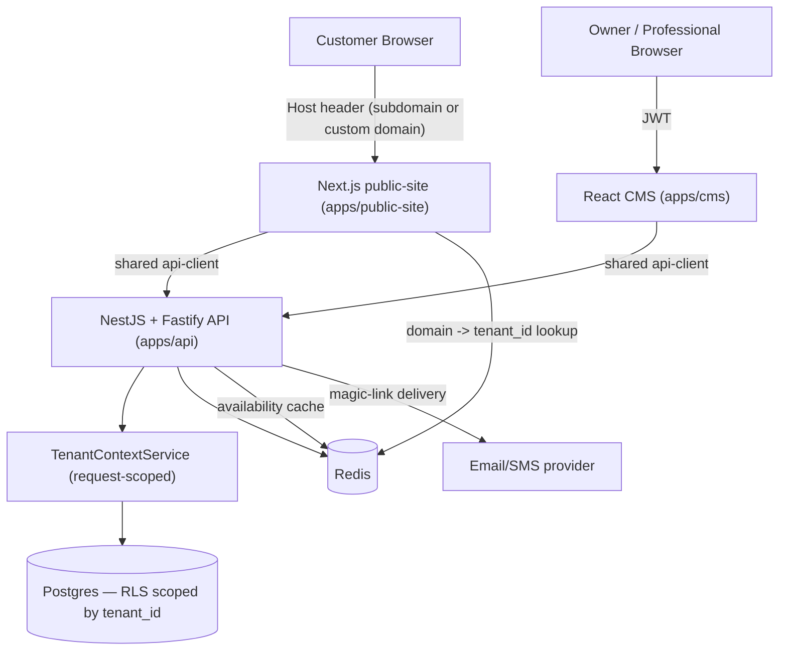

System architecture for the multi-tenant booking platform. This doc covers how the pieces fit together and run; entity-level schema, the ER diagram, and capacity math live in `Unified Requirements and Data Model.md` and are referenced rather than repeated here.

## 1. Overview

One backend, two customer-facing apps, one shared Postgres database. Salons (tenants) manage their business through a CMS; their customers book through a public site branded per-tenant. Neither app is deployed per-tenant — tenant identity is resolved dynamically at request time, not baked into a build.

## 2. Component Diagram



## 3. Monorepo & Application Structure

Turborepo (or Nx), one repo, affected-only builds so the two frontend apps don't couple release cadence to each other:

```
apps/
  api/            NestJS + Fastify — all business logic, RLS-aware DB access
  cms/            React — owner/professional login, tenant management
  public-site/    Next.js (SSR/ISR) — customer-facing, tenant resolved per request
packages/
  api-client/     typed client shared by cms + public-site
  shared-types/   Tenant/Service/Professional/Appointment/DTO shapes
  config/         eslint/tsconfig/tailwind config
  ui/             optional — only truly generic, non-branded pieces, if any
```

`shared-types` and `api-client` are what actually justify the monorepo here — the two frontends don't share UI, but they share a contract with `apps/api`, and that contract needs to change atomically across all three when the schema moves.

## 4. Multi-Tenancy Model

Shared tables + `tenant_id` + Postgres Row-Level Security on every table, including junction tables (`ServiceProfessional`) — chosen over table-per-tenant or schema-per-tenant to avoid migration overhead, catalog bloat, and to keep cross-tenant admin/reporting queries possible. Tenant resolution differs by app:

- **CMS**: tenant identity comes from the JWT (`tenant_id`, `role`, `professional_id` claims), issued at login.
- **Public site**: tenant identity comes from the request's `Host` header, resolved to a `tenant_id` via Redis (subdomain or custom domain → tenant), falling back to Postgres on a cache miss.

Either way, the resolved `tenant_id` is handed to a request-scoped `TenantContextService` in the API, which is the single place that sets the Postgres session variable RLS policies key off (e.g. `SET LOCAL app.tenant_id = $1` per transaction) — application code never manually filters by `tenant_id`; the database enforces it.

## 5. Data Layer

Postgres is the only datastore (no Mongo). Full entity list, column types, and the ER diagram are in `Unified Requirements and Data Model.md`; the short version: `Tenant`, `Professional`, `TenantUser`, `Service`, `ServiceProfessional` (join table), `BusinessHours`, `TimeOff`, `Appointment`. Availability is computed at query time (`BusinessHours` minus `TimeOff` minus existing `Appointment`s) rather than stored as pre-generated slot rows — avoids keeping a second table in sync with every booking/cancellation.

`Tenant.config_json` (JSONB) holds presentation config (theme, logo, copy); everything queryable — pricing, hours, staff, bookings — is normalized columns, not JSON blobs.

## 6. Authentication & Authorization

Two separate identity systems, deliberately not unified:

- **CMS (`TenantUser`)**: email + password, JWT-issued. Exactly one `owner` role per tenant (partial unique constraint); any number of `professional` roles, each optionally linked to a `Professional` business record via nullable `professional_id`. `owner` has full CMS access; `professional` is restricted to their own appointments and their own hours/time-off. Role enforcement happens in the API layer, not in Postgres — RLS scopes rows to a tenant, it has no concept of roles within a tenant. Deactivating a `Professional` record does not cascade to disable their login; the owner does that by hand.
- **Public site customers**: no accounts at all. Each `Appointment` carries a hashed, expiring access token; visiting `/manage/{token}` authorizes actions against that one appointment only (details below).

### Magic Link Flow

1. Customer books (name, phone, email — no signup).
2. Server generates a token, stores its hash + expiry (`appointment end + 24h`) on the `Appointment` row.
3. Server emails a link to `/manage/{token}`.
4. The link scopes access to that single appointment — it's not a login, and it grants no access to any other booking.
5. Rescheduling rotates the token (old one invalidated).
6. Lost-link recovery: customer enters their phone number; server looks up upcoming, non-cancelled appointments for that number and re-sends valid tokens — rate-limited to prevent phone-number enumeration.

## 7. Domain & Tenant Routing

- **Subdomains** (default, zero per-tenant setup): one wildcard DNS record + one wildcard TLS cert cover every tenant. New tenant = insert a row; nothing else to provision.
- **Custom domains** (opt-in): tenant CNAMEs their domain to the platform; ownership is verified via a DNS TXT challenge before `Tenant.domain_verified_at` is set; TLS is provisioned per-domain via a managed provider (Cloudflare for SaaS / Vercel Domains API) rather than a self-run ACME setup, to avoid rate-limit and abuse issues as domain count grows.
- At pilot scale, custom-domain verification and cert provisioning are done by hand (per §9); this doc doesn't assume automated self-serve domain tooling exists yet — see `Unified Requirements and Data Model.md` → Capacity Estimates for the point (~10K tenants) where that stops being optional.

## 8. Caching Strategy (Redis)

- **Domain → tenant_id resolution**: on the hot path for every public-site request; short TTL or explicit invalidation on tenant domain changes.
- **Computed availability**: short-TTL cache per tenant/professional/day, since slots shift with every booking — not a substitute for the source-of-truth query, just load-shedding.
- Redis is not used as a system of record anywhere — losing it degrades latency (falls back to Postgres) rather than losing data.

## 9. Onboarding (current, manual)

Pilot tenants are onboarded by staff, not self-serve:

1. Business terms agreed directly with the salon owner.
2. An internal script/CLI creates the `Tenant` row + initial `TenantUser` (`owner`) in one transaction, assigning a subdomain.
3. Subdomain is live immediately (wildcard DNS/cert already cover it).
4. Owner sets their password and fills in services/professionals/hours themselves in the CMS.
5. Custom domain (if wanted): CNAME + TXT verification done by hand; domain added via the TLS provider's dashboard.
6. Smoke test: subdomain resolves, one end-to-end test booking, confirm branding renders correctly.

Self-serve signup, automated domain verification, and admin dashboards for managing tenants are deliberately deferred until tenant count makes manual onboarding the bottleneck.

## 10. Deployment Topology

- **Local**: `docker-compose.yml` — Postgres, Redis, and all three apps, one command.
- **Production**: managed Postgres (RDS/Cloud SQL/Neon-class) and managed Redis (ElastiCache/Upstash-class) rather than self-run containers, for backups/failover/HA. Apps run as containers on a PaaS or lightweight orchestrator (Fly.io, Railway, ECS) — `docker-compose` itself isn't a production orchestrator. ISR pages from `public-site` sit behind a CDN/edge cache.
- This topology holds through the 500-tenant stage without changes; see §11 for what's added as scale increases.

## 11. Scaling Plan

Full numbers in `Unified Requirements and Data Model.md` → Capacity Estimates. Summary of what actually changes at each threshold:

- **~500 tenants**: current topology as-is. No pooler, no read replica, no partitioning.
- **~10,000 tenants**: horizontal scaling of the public-site/API tier; add PgBouncer (Postgres connection limits get exceeded by pooled connections from multiple app replicas); add a read replica to keep CMS/reporting reads off the primary; start planning monthly partitioning of `Appointment`; move custom-domain verification/issuance from manual to an automated provider API.
- **~100,000 tenants**: partition `Appointment` by month (and likely sub-partition by `tenant_id` hash) so RLS filtering and partition pruning cooperate; Redis needs to be HA (a single instance failing now affects every tenant, not one); sharding tenants across multiple Postgres clusters becomes a legitimate discussion rather than premature optimization; custom-domain tooling needs renewal monitoring and churn cleanup, not just initial issuance.

The shared-tables-plus-RLS decision doesn't change at any of these points — what's added is operational scaffolding around it.

## 12. Non-Functional Requirements Mapping

| requirement | how it's met |
|---|---|
| SEO | ISR pages (landing, services) on `public-site`, not client-rendered |
| P95 < 300ms | Redis-cached domain resolution on the hot path; flagged as an aggressive target worth validating against cold-cache/custom-domain cases early |
| Mobile-first | `public-site` design constraint, not an infra concern |
| Every table tenant-scoped | Postgres RLS on every table, enforced via `TenantContextService`, no exceptions |

## 13. Open Items

- Payment is out of scope for now (reservation-only booking, customer pays in person) — no `PaymentProvider`/gateway architecture is included in this doc. Revisit and add a Payment Architecture section when that work is scheduled.
- Whether "service without a professional" (resource/walk-in-style bookings) needs to be explicitly supported — if so, needs a `Service.requires_professional` flag and a capacity model, since nothing currently prevents double-booking a professional-less service.
- Passwordless/OTP login for CMS was considered and explicitly declined in favor of email+password — noted here so it isn't re-litigated without a reason to revisit.
